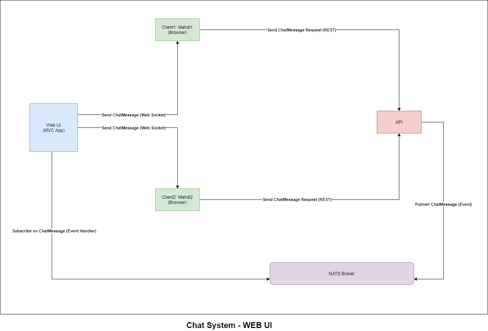
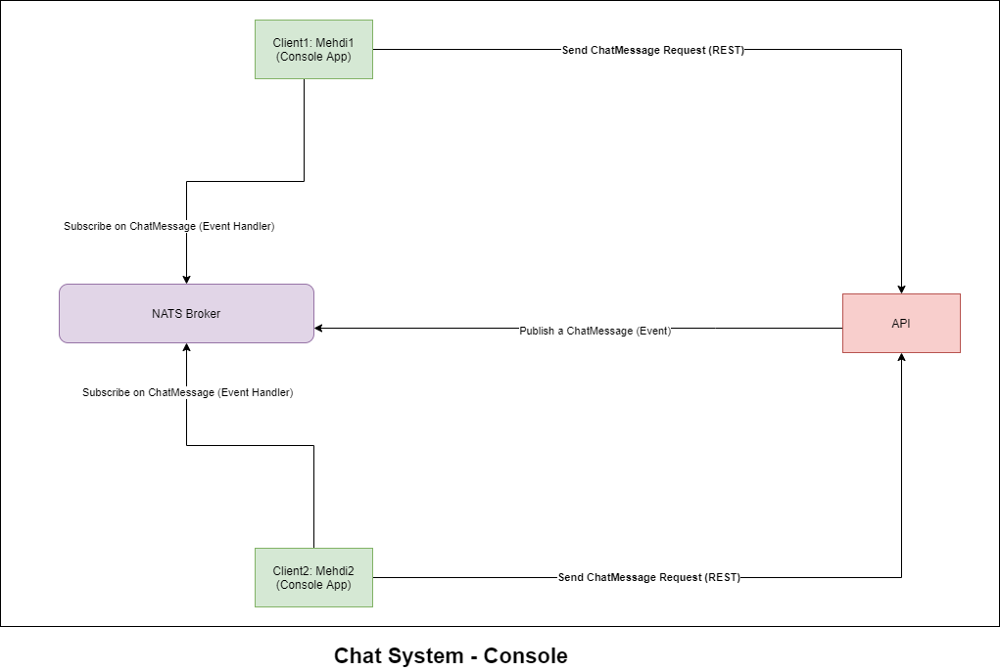
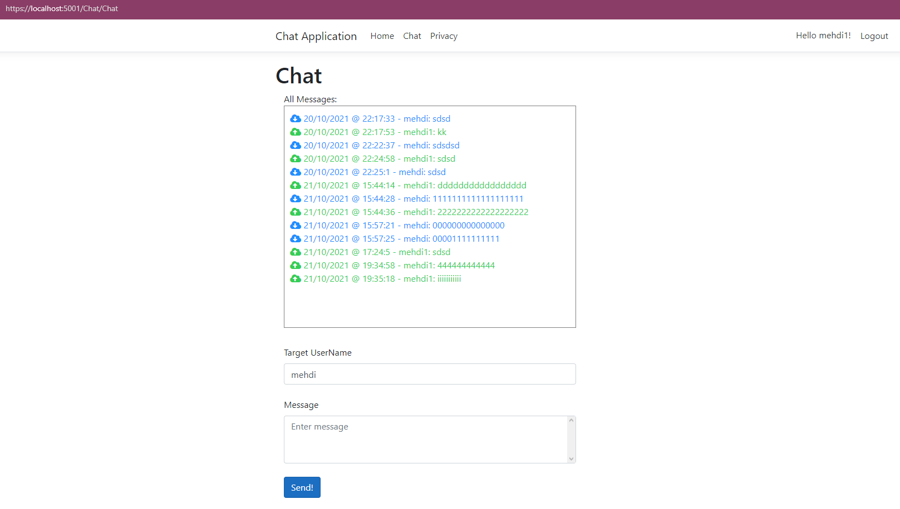
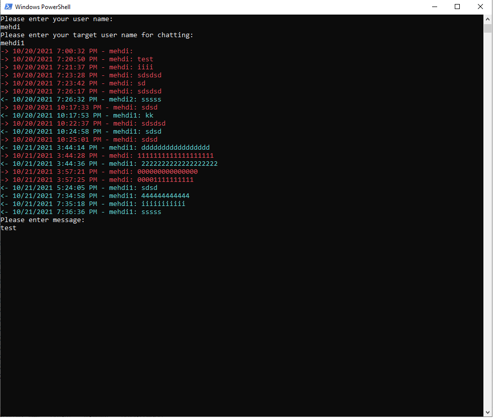

# Table of Content
- [Distributed Chat System](#distributed-chat-system)
  - [Chat System - WEB UI](#chat-system---web-ui) 
  - [Chat System - Console](#chat-system---console)
  - [How to run](#how-to-run)
    - [WEB UI Client](#web-ui-client)
    - [Console Client](#console-client)

# Distributed Chat System

For implementing this system I used two different Client UI:
1) [WEB UI](#chat-system---web-ui): Using MVC .Net Core Application and SignalR (WebSockets) as our client
2) [Console](#chat-system---console): Using .Net Core Console Application as our client

## Chat System - WEB UI

When Web & API tiers are separated, it is impossible to directly send a server-to-client message from the HTTP API. This is also true for a microservice architected application. We use the distributed event bus ([NATS](https://nats.io/)) to deliver the message from API application to the web application, then to the client.



In above picture, we can see the data-flow that we implemented with using [MVC Web Application](./src/Chat.Web) as Client. This diagram represents how data will flow in our application when Client 1 sends a message to Client 2. It is explained in 5 steps:

1) Client 1 sends a message data to our [Web UI](./src/Chat.Web) through a user interface form.
2) Web Application will call our [API](./src/Chat.API) service via a REST call.
3) The message data is processed in our [API](./src/Chat.API) service and API service publishes an event to our NATS message broker, that holds the data that will be sent to Client 2.
4) [Web UI](./src/Chat.Web), that is subscribed to that event through our NATS message broker, receives it via a event handler.
5) [Web UI](./src/Chat.Web) sends the message to Client 2 via a web socket (signalr) connection.


## Chat System - Console



In above picture, we can see the data-flow that we implemented with using [Console Application](./src/Chat.Console) as Client. This diagram represents how data will flow in our application when Client 1 sends a message to Client 2. It is explained in 3 steps:

1) Client1 or first [Console Application](./src/Chat.Console) sends a message data to our [API](./src/Chat.API) service through a REST call.
2) The message data is processed in our [API](./src/Chat.API) service and API service publishes an event to our NATS message broker, that holds the data that will be sent to Client 2.
3) Our Client2 [Console Application](./src/Chat.Console), that is subscribed to that event through our NATS message broker, receives it via a event handler.


## How to run
For running NATS on our system we can use [docker-compose.yaml](./docker-compose.yaml) file, and run bellow command for running NATS

``` cmd
 docker-compose -f .\docker-compose.yaml up
```


### WEB UI Client
For running our system with using [WEB UI](#chat-system---web-ui) we need to run our [MVC Application](./src/Chat.Web) as client and [API](./src/Chat.API) as a service.

``` cmd
.\scripts\api.bat
.\scripts\web-client.bat
```

Then after these two application were up and running, our API service will be host on `https://localhost:7001` and our MVC application will be host on `https://localhost:5001`.
Now on `https://localhost:5001` address we can create some new user for chatting purpose. In seed of our application there are some predefined users with below information:

``` cmd
Email: mehdi@yahoo.com
UserName: mehdi
Password: 000000

Email: mehdi1@yahoo.com
UserName: mehdi1
Password: 000000

Email: mehdi2@yahoo.com
UserName: mehdi2
Password: 000000
```

Now we can chat between our different users with different session in browser Incognito Mode.



### Console Client

For running our system with using [Console Application](#chat-system---console) we need to run our [API](./src/Chat.API) as a service also we need to run multiple [Console Application](./src/Chat.Console) as clients.

``` cmd
.\scripts\api.bat
```
Then run multiple console client with this command:

``` cmd
.\scripts\console-client.bat
```
After entering our user name and destination user name for chat we can chat between our clients.



## Dockerize
For creating image for API we should execute bellow command
``` powershell
docker build -t chat.api . -f API.Dockerfile 
```

Because our app runs on https port, Kestrel can’t start because no certificate was specified and no developer certificate could be found [Link1](https://www.yogihosting.com/docker-https-aspnet-core/), [Link2](https://www.programmingwithwolfgang.com/asp-net-core-with-https-in-docker).

We can create a certificate with the following command:

``` powershell
dotnet dev-certs https --clean
dotnet dev-certs https -ep $env:USERPROFILE\.aspnet\https\aspnetapp.pfx -p 000000
dotnet dev-certs https --trust
```

Now for running our API we run this command:

``` powershell
docker run  -p 7001:7001 -p 7000:7000  -e ASPNETCORE_Kestrel__Certificates__Default__Password="000000" -e ASPNETCORE_Kestrel__Certificates__Default__Path=/https/aspnetapp.pfx -v $env:USERPROFILE\.aspnet\https:/https/ chat.api
```
